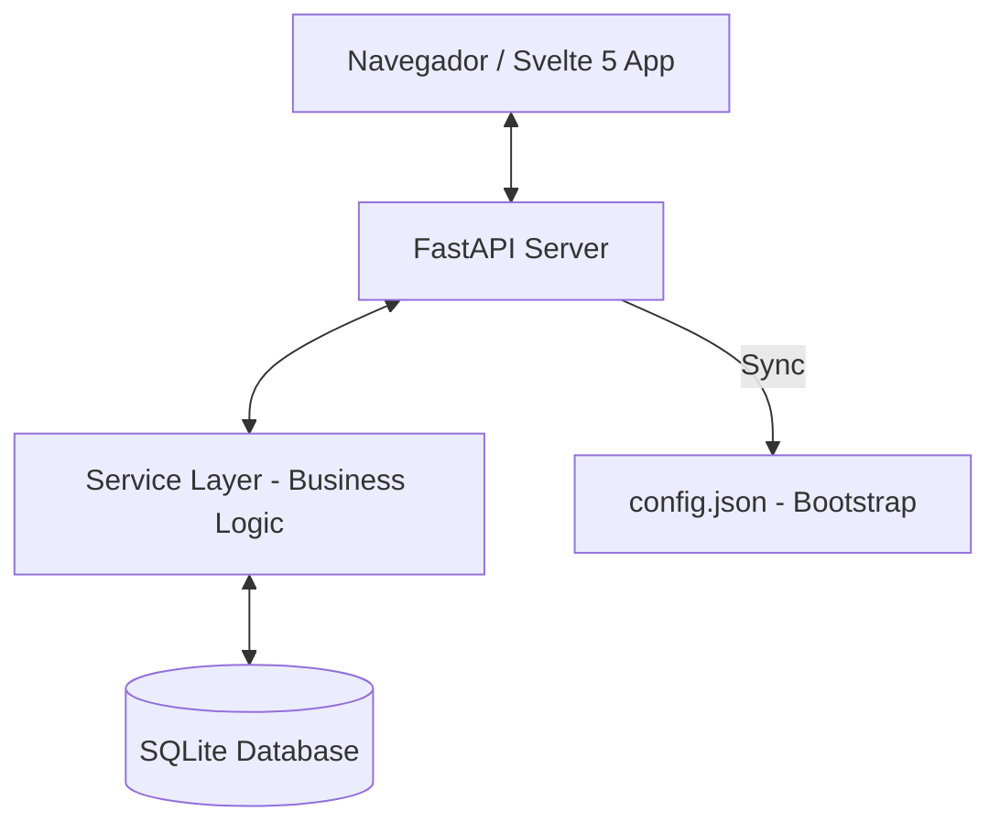
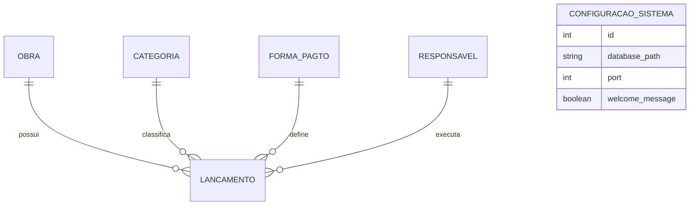
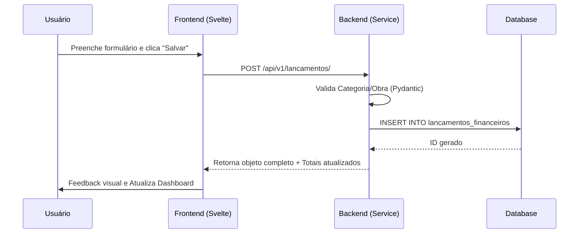

# Diagramas do Sistema: ObrasFinance

## Arquitetura do Sistema

```mermaid
graph TD
    Client[Navegador / Svelte 5 App] <--> API[FastAPI Server]
    API <--> Service[Service Layer - Business Logic]
    Service <--> DB[(SQLite Database)]
    API -- Sync --> Config[config.json - Bootstrap]
```

## Diagrama ERD (Banco de Dados)

```mermaid
erDiagram
    OBRA ||--o{ LANCAMENTO : possui
    CATEGORIA ||--o{ LANCAMENTO : classifica
    FORMA_PAGTO ||--o{ LANCAMENTO : define
    RESPONSAVEL ||--o{ LANCAMENTO : executa
    CONFIGURACAO_SISTEMA {
        int id
        string database_path
        int port
        boolean welcome_message
    }
```

## Fluxo Principal: Criação de Lançamento Financeiro

```mermaid
sequenceDiagram
    participant U as Usuário
    participant F as Frontend (Svelte)
    participant B as Backend (Service)
    participant D as Database

    U->>F: Preenche formulário e clica "Salvar"
    F->>B: POST /api/v1/lancamentos/
    B->>B: Valida Categoria/Obra (Pydantic)
    B->>D: INSERT INTO lancamentos_financeiros
    D-->>B: ID gerado
    B-->>F: Retorna objeto completo + Totais atualizados
    F->>U: Feedback visual e Atualiza Dashboard
```
